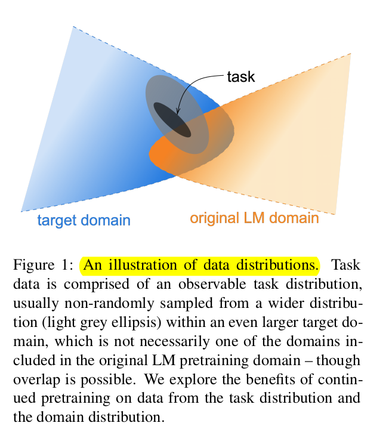
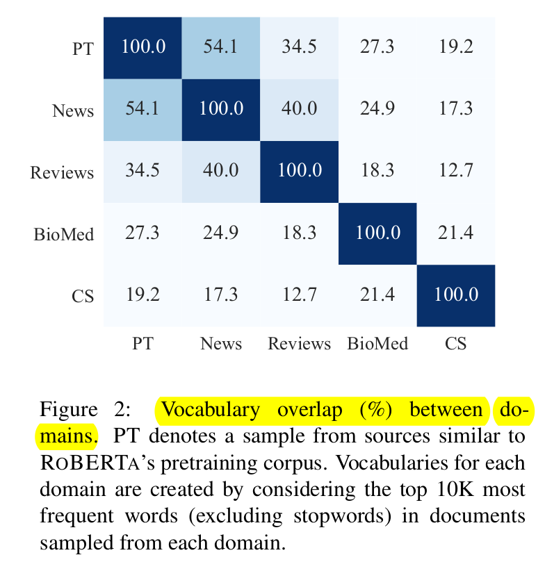
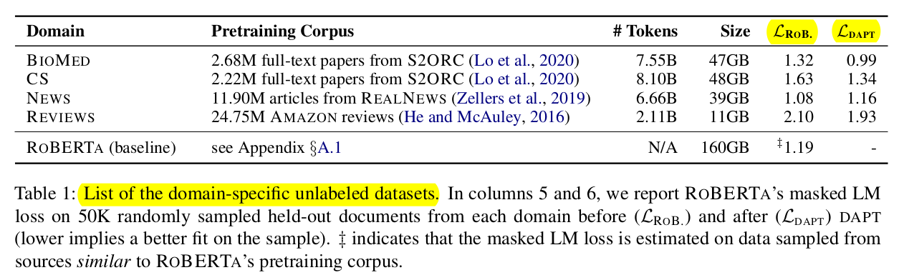
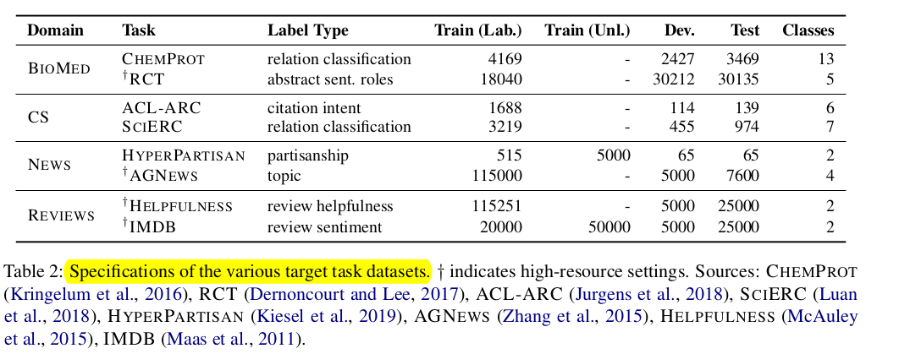
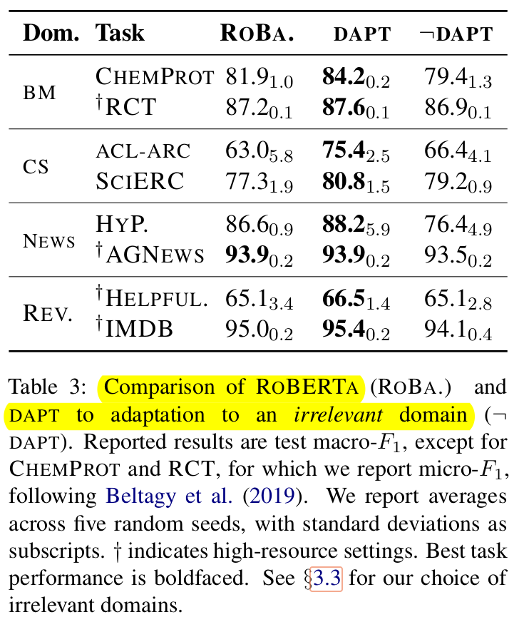
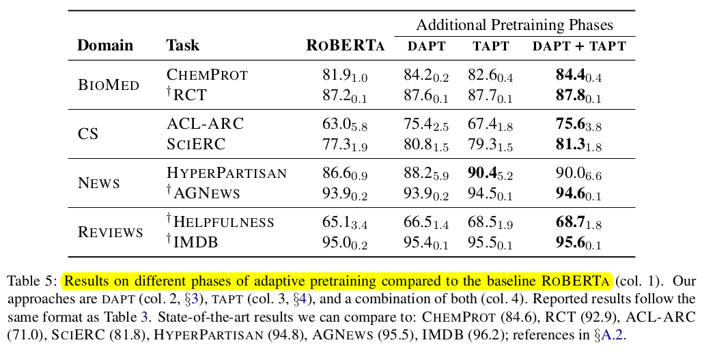
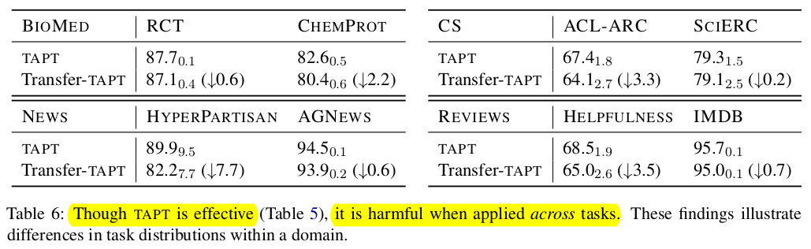

# Don't Stop Pretraining: Adapt Language Models to Domain and Tasks
- Research Paper: https://aclanthology.org/2020.acl-main.740.pdf
- Paper Commentry: https://data-analytics.fun/2020/10/12/understanding-better-pretraining/
# Overview
The study highlights the importance of adaptive pretraining techniques, including both domain-adaptive and task-adaptive pretraining, in improving the performance of pretrained language models across various tasks and domains. 

1. **Domain-Adaptive Pretraining**: By conducting a second round of training on data from specific domains (such as biomedical and computer science publications, news articles, and reviews), the study observed improved performance in various classification and categorization tasks. This suggests that additional pretraining of pretrained models on domain-specific data can enhance their ability to understand and generate language relevant to those domains.

2. **Task-Adaptive Pretraining**: Adapting the models to the specific unlabeled data related to the task further improved performance, even after domain-adaptive pretraining. This highlights the importance of fine-tuning models not only for specific domains but also for the particular task at hand. It suggests that task-specific adaptations help the model better capture nuances and patterns relevant to the task, leading to improved performance.

3. **Resource Efficiency**: The study found that these improvements were achieved even with limited resources or small amounts of labeled data. This is significant because it demonstrates that adaptive pretraining techniques can be effective even in resource-constrained scenarios, making them practical and accessible for a wide range of applications.

4. **Task-Specific Dataset Creation**: Another effective approach identified in the study was to create task-specific datasets by selecting relevant data in a simple manner. This approach proved valuable, especially when resources for domain-adaptive pretraining were lacking. It suggests that task-specific dataset creation can serve as a viable alternative or complement to domain-adaptive pretraining, particularly in resource-constrained settings.
# Introduction

This research highlights the importance of considering domain and task specificity even when using powerful LLMs like RoBERTA. By strategically applying domain-adaptive and task-adaptive pretraining techniques, NLP practitioners can unlock the full potential of these models and achieve superior performance on diverse tasks, even with limited labeled data resources.

- **Limited Benefit of Universal LLMs:** While large pre-trained models like RoBERTA perform well on various tasks, the study highlights that **domain-specific knowledge** can still be crucial for optimal performance.
    
- **Effectiveness of Domain-Adaptive Pretraining:** Further training the LLM on unlabeled data from the target domain (e.g., biomedicine) demonstrably improves performance on tasks within that domain (e.g., disease classification). This is true even with **limited labeled data** for the specific task.
    
- **Task-Adaptive Pretraining Enhances Performance:** The research shows that pretraining on the specific unlabeled task data (e.g., unlabeled reviews) can significantly enhance performance on the target task (e.g., sentiment analysis), even after domain-adaptive pretraining.
    
- **Benefits of Additional Task Data:** The study finds that incorporating **curated task-specific unlabeled data**, selected by experts, further improves performance, especially in scenarios with limited labeled data.
    
- **Automatic Task-Relevant Text Selection:** The research proposes methods for automatically selecting relevant unlabeled text for TAPT, offering a potentially scalable approach for performance improvement, particularly for tasks with limited resources.
    
- **Competitive Results:** By leveraging DAPT and TAPT, the study demonstrates that LLMs can achieve state-of-the-art performance on various NLP tasks.

# Background: Pretraining
The learning process for most NLP research systems since 2018 typically involves two stages:

1. **Pretraining**: In the first stage, a neural language model (LM) is trained on large unlabeled corpora. This LM, which often has millions of parameters, learns representations of words or wordpieces from the input text. The pretrained LM captures general language patterns and knowledge from the data.
    
2. **Fine-tuning**: In the second stage, the pretrained LM is used as a foundation for specific downstream tasks. The representations learned in the pretrained model are reused and fine-tuned during supervised training on labeled data for the target task. This process updates the representations and network to adapt them to the specific task.

One example of a pretrained LM is RoBERTA, which is built upon the BERT model and uses a transformer-based architecture. RoBERTA is pretrained on a large corpus of over 160 GB of uncompressed English-language text, obtained from various sources. It is trained using a masked language modeling objective, where the model predicts randomly masked tokens.

While RoBERTA performs well on a range of tasks, it is unclear whether its pretraining corpus covers the full diversity of the English language. To investigate this, further adaptation is explored through continued pretraining on two types of unlabeled data:

1. **Domain-specific text**: Large corpora of text from specific domains are used for continued pretraining. This additional pretraining helps the model adapt to domain-specific language and improve its performance on tasks within those domains.
    
2. **Available unlabeled data**: If domain-specific text is not available, the model can be further adapted by utilizing other unlabeled data that is relevant to the target task.
    

By examining the effects of continued pretraining on these types of data, researchers aim to understand the limits and generalizability of RoBERTA's pretrained representations and explore ways to improve its performance on specific tasks.

# Domain-Adaptive Pretraining
In the domain-adaptive pretraining (DAPT) approach, the researchers continue the pretraining of RoBERTA by using a large corpus of unlabeled text that is specific to the target domain. In this study, they focus on four domains: biomedical (BIOMED) papers, computer science (CS) papers, news text from REAL NEWS , and AMAZON reviews. These domains are chosen because they have been widely explored in previous research and there are available datasets for text classification tasks.

### Analyzing Domain Similarity

Before conducting domain-adaptive pretraining (DAPT), the similarity between the target domain and RoBERTA's pretraining domain is assessed. This assessment involves comparing the domain vocabularies, specifically the top 10K most frequent unigrams (excluding stopwords), in comparably sized random samples of held-out documents from each domain's corpus.

### Experiments

Our LM adaptation follows the settings prescribed for training RoBERTA . We train RoBERTA on each domain for 12.5K steps, which amounts to single pass on each domain dataset, on a v3-8 TPU. We present the masked LM loss of RoBERTA on each domain before and after DAPT in Table-1. We observe that masked LM loss decreases in all domains except News after DAPT , where we observe a marginal increase.

### Baseline

The authors mention that they use an off-the-shelf RoBERTA-base model as their baseline. This means that they take the pretrained RoBERTA model and fine-tune its parameters specifically for each classification task they are working on. The baseline model, RoBERTA , is considered to be a good starting point because it performs reasonably well and provides a single language model that can be adapted to different domains. The authors note that the performance of RoBERTA is not significantly behind the state of the art in their experiments.

The extent of improvement is large for BioMed and CS, which had little overlap with RoBERTa's pre-training data. The reason why additional pre-training with news data does not seem to have any effect is that it is already used in RoBERTa's pre-training.

### Classification Problem

Prepare two datasets, one with more data and one with less data, for each domain. Then, for each dataset, perform supervised learning and classify.

The result is below:

The “DAPT” column (4th column from the left) is the result of solving the classification problem by performing DAPT, but it **outperforms RoBERTa on datasets other than AGNEWS in the news domain**. In other words, it is suggested that **pretraining tailored to the domain is effective if it is less relevant to the RoBERTa pretraining corpus**. However, even in the news domain, the HyperPartisan data set has improved accuracy, so it can be seen that a certain effect can be obtained even in the same domain.

**Domains Relevance for DAPT**

Next, we will see what happens when **DAPT is used with datasets outside the domain of the target task**. CS data and BioMed data are used for the News domain, News data for the CS domain, and Review data for the BioMed domain as pre-training data.

The rightmost column of Table 3 above is the result. We can see that **the accuracy is worse for all datasets than when DAPT is performed using the target task domain dataset**. And except for ACL-ARC and SciErc, the accuracy is worse than the baseline RoBERTa. **What we can see from** **this is that** **DAPT must be performed on a dataset of the target task domain** (appropriate domain), **rather than simply increasing the amount of pre-learning data**.

# Task-Adaptive Pretraining (TAPT)
**TAPT involves pretraining the model on the unlabeled training set specific to a given task**. This means using the text data that is directly relevant to the task at hand. While DAPT uses a large pretraining corpus from specific domains to adapt the model, TAPT uses a much smaller pretraining corpus that is highly task-relevant. The assumption is that the training set for the task captures the important aspects of the task well. The authors highlight that **TAPT is less computationally expensive compared to DAPT because it uses a smaller pretraining corpus**. Moreover, **they mention that in their experiments, they found the performance of TAPT to be competitive with that of DAPT**.

When comparing DAPT and TAPT, TAPT accuracy exceeds DAPT accuracy in RCT, HyperPartisan, AGNews, Helpfulness, and IMDB. Again, it does not use as much data as DAPT, and it exceeds the accuracy of DAPT with a relatively small data set, so it is considered to be very efficient, so basically it is better to do it in practice.

### Combined DAPT and TAPT

In their study, the authors explore the effectiveness of combining both domain-adaptive pretraining (DAPT) and task-adaptive pretraining (TAPT) techniques. They begin with a baseline RoBERTA model and apply DAPT first, followed by TAPT under this setting. This combined approach involves three phases of pretraining, making it the most computationally expensive among all the settings considered.

The results indicate that the combined domain- and task-adaptive pretraining achieves the best performance on all tasks, as shown in Table 5. This approach leverages both domain awareness and task relevance, leading to superior results compared to individual adaptation techniques.

The authors speculate that reversing the order of TAPT followed by DAPT may lead to catastrophic forgetting of the task-relevant corpus. However, they suggest that alternative methods of combining these procedures could potentially result in even better downstream performance. Future research may explore pretraining approaches with a more sophisticated curriculum that incorporates a combination of domain and task distributions.

### Transfer Learning between tasks

In order to investigate the transferability of adaptation from one task to other tasks within the same domain, the authors introduce a setting called Transfer-TAPT. They perform additional pretraining on the LM using the unlabeled data from a specific task (e.g., RCT) and then fine-tune it with labeled data from a different task (e.g., CHEMPROT). The results for tasks in all four domains are presented in Table 6.

The findings indicate that TAPT, which focuses on optimizing performance for a single task, tends to have a negative impact on cross-task transfer. This suggests that the data distributions of tasks within a given domain can vary significantly. Consequently, adapting solely to a broad domain may not be sufficient for achieving optimal performance on all tasks. This finding supports the effectiveness of performing DAPT before TAPT, as it allows for a more comprehensive adaptation that takes into account both domain and task-specific characteristics.

