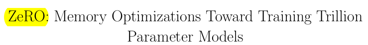

# Research Paper Summary

# Abstract
- Training very large deep learning models with billions to trillions of parameters is challenging due to memory limitations.
- Zero Redundancy Optimizer (ZeRO) has been developed as a novel solution to optimize memory usage and improve training speed.
- ZeRO eliminates memory redundancies in data- and model-parallel training, enabling efficient scaling of model size based on the number of devices used.
- ZeRO implementation and evaluation: Trained models with over 100 billion parameters on 400 GPUs, achieving super-linear speedup and a throughput of 15 Petaflops.
- ZeRO (Zero Redundancy Optimizer) enables training models with up to 13 billion parameters without requiring model parallelism, improving speed and efficiency.
- ZeRO innovations enabled creation of world's largest language model with 17B parameters and record-breaking accuracy.
# Introduction
