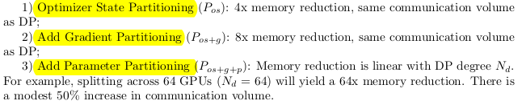
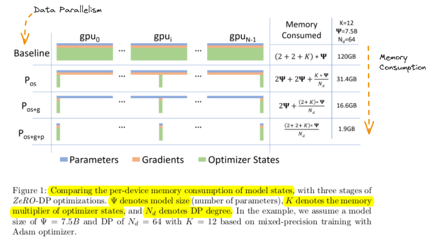

| References | Link |
| --- | --- |
| Research Paper | ZeRO: Memory Optimizations Toward Training Trillion Parameter Models |

# Abstract
- Training very large deep learning models with billions to trillions of parameters is challenging due to memory limitations.
- Zero Redundancy Optimizer (ZeRO) has been developed as a novel solution to optimize memory usage and improve training speed.
- ZeRO eliminates memory redundancies in data- and model-parallel training, enabling efficient scaling of model size based on the number of devices used.
- ZeRO implementation and evaluation: Trained models with over 100 billion parameters on 400 GPUs, achieving super-linear speedup and a throughput of 15 Petaflops.
- ZeRO (Zero Redundancy Optimizer) enables training models with up to 13 billion parameters without requiring model parallelism, improving speed and efficiency.
- ZeRO innovations enabled creation of world's largest language model with 17B parameters and record-breaking accuracy.
# Introduction
- Data Parallelism (DP)
	- Involves replicating the entire model across all devices, which leads to redundant memory consumption.
- Model Parallelism (MP)
	- Divides the model into layers that are processed by different devices.
- Among different existing solution for training large models, MP is the most promising.
- The limitations of MP become apparent when scaling beyond certain model sizes (11B T5 model, and Megatron-LM 8.3B) due to increased communication requirements between layers.
- The memory consumption during model training can be divided into two main parts:
	1. Majority memory occupied by Model States
		- Include optimizer states (such as momentum and variances in Adam), gradients and parameters.
	2. Remaining memory occupied by Residual States
		- Include activation, temporary buffers, and unusable fragmented memory.
- Optimizing Model State Memory
	- Zero-powered data parallelism (ZeRO-DP)combines communication efficiency of DP with memory efficiency of MP.
	- ZeRO-DP has three main optimization stages:
	
	
- Optimizing Residual State Memory
	- ZeRO-R is developed to optimize residual memory consumed by activation, temporary buffers, and unusable fragmented memory respectively.
		1. Activations (stored from forward pass for backward pass) are optimized through activation partitioning to remove replication in existing MP approaches. Offloading activations to CPU when appropriate also helps in optimizing activation memory.
		2. Temporary buffers have an appropriate size defined by ZeRO-R to balance memory and computation efficiency effectively.
		3. Fragmented memory during training due to varying lifetimes of tensors can lead to allocation failures even with enough free space. ZeRO-R proactively manages this fragmentation issue based on tensor lifetimes.
- ZeRO and MP
	- ZeRO-DP is demonstrated to be equally or more effective than MP in decreasing per-device memory usage, particularly when MP encounters challenges in evenly dividing the model across devices.
	- There are specific scenarios where leveraging Model Parallelism (MP) alongside ZeRO can be advantageous:
		1. When combined with ZeRO-R, Model Parallelism (MP) can help reduce activation memory usage for very large models.
		2. For smaller models where activation memory is not an issue, MP can also have benefits when aggregated batch size using DP alone is too big to have good convergence.
- Implementation and Evaluation
