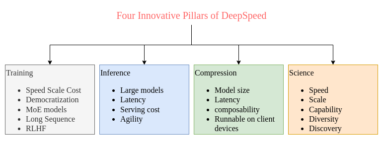

# DeepSpeed
[DeepSpeed](https://github.com/microsoft/DeepSpeed) is an easy-to-use deep learning optimization software suite that powers unprecedented scale and speed for both training and inference.

| S.N | Pillars | Documentation |
| :--: | ---- | ---- |
| 1 | Training | [DeepSpeed-Training](https://www.deepspeed.ai/training) |
| 2 | Inference | [DeepSpeed-Inference](https://www.deepspeed.ai/inference) |
| 3 | Compression | [DeepSpeed-Compression](https://www.deepspeed.ai/compression) |
| 4 | Science | [DeepSpeed4Science](https://www.deepspeed.ai/deepspeed4science/) |

DeepSpeed has been integrated with several different popular open-source DL frameworks such as:

# Resources

| Research Paper | Link | note |
| ---- | ---- | ---- |
| ZeRO: Memory Optimizations Toward Training Trillion Parameters Model | [link](./pdf/ZeRO.pdf) | [link](./note/rough-research-paper-note.md) |

| Blog | Link |
| --- | --- |
|  |  |

| Videos | Link |
| --- | --- |
|  |  |

