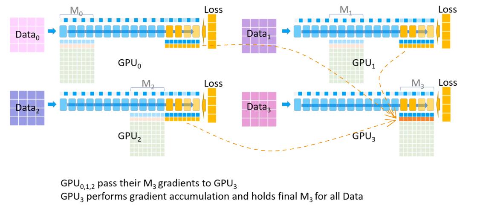

# ZeRO
### Lets Understand this First
The memory consumption during model training can be divided into two main parts:

1. **Majority memory occupied by Model States**
    - Include optimizer states (such as momentum and variances in Adam), gradients and parameters.
2. **Remaining memory occupied by Residual States**
    - Include activation, temporary buffers, and unusable fragmented memory.

### How DeepSpeed Optimize Memory
To be exact DeepSpeed implements **Zero Redundancy Optimizer** (**ZeRO**), a novel memory optimization technology for large-scale distributed deep learning.
**Optimizing Model State Memory**
For this optimization, **Zero-powered data parallelism** (**ZeRO-DP**) is introduced which combines:

- Communication Efficiency of Data Parallelism (DP) with
- Memory Efficiency of Model Parallelism (MP).

ZeRO-DP has three main optimization stages (as shown in Figure 1):

**Optimizing Residual State Memory**

**ZeRO-R** is developed to optimize residual memory consumed by activation, temporary buffers, and unusable fragmented memory respectively.

1. Activations (stored from forward pass for backward pass) are optimized through activation partitioning to remove replication in existing MP approaches. Offloading activations to CPU when appropriate also helps in optimizing activation memory.
2. Temporary buffers have an appropriate size defined by ZeRO-R to balance memory and computation efficiency effectively.
3. Fragmented memory during training due to varying lifetimes of tensors can lead to allocation failures even with enough free space. ZeRO-R proactively manages this fragmentation issue based on tensor lifetimes.
# Visualize ZeRO-DP
| Steps | Visualization | Comment |
| :--: | :--- | :--- |
| 1 |  |  |
| 2 |  | **Split the whole data into 4 equal parts for each GPU to process.** |
| 3 |  |  |
| 4 |  | **GPU Memory Used by Model Parameters, Gradients and Optimizers** |
| 5 |  |  |
| 6 |  |  |
| 7 |  | **To effectively compute and apply the updates at the end of the backward propagation, the mixed-precision optimizer keeps an fp32 copy of the parameters as well as an fp32 copy of all the other optimizer states.** |
| 8 |  |  |
| 9 |  |  |
| 10 |  | **Forward Pass starts from this step** |
| 11 |  | **Broadcasts model parameters of GPU 0 to other GPUs.** |
| 12 |  |  |
| 13 |  | **Once Forward Pass is completed, delete model parameters of GPU 0 stored in GPU 1, 2, and 3.** |
| 14 |  | **Replicate the process performed in steps 11, 12, and 13 on the remaining GPUs as well.** |
| 15 |  |  |
| 16 |  | **Once forward pass is completed, calculate loss on each GPU for its respective dataset.** |
| 17 |  | **Backward Propagation from this step** |
| 18 |  |  |
| 19 |  |  |
| 20 |  |  |
| 21 |  | **Replicate the process performed in steps 18, 19, and 20 on the remaining GPUs as well.** |
| 22 |  |  |
| 23 |  |  |
| 24 |  | **Parameter Update start from this step** |
| 25 |  |  |
| 26 |  |  |
| 27 |  | **Training Iteration is completed** |
