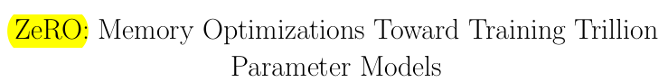
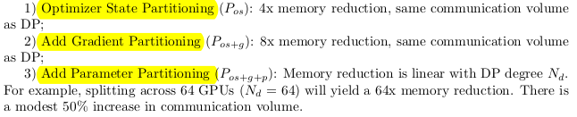
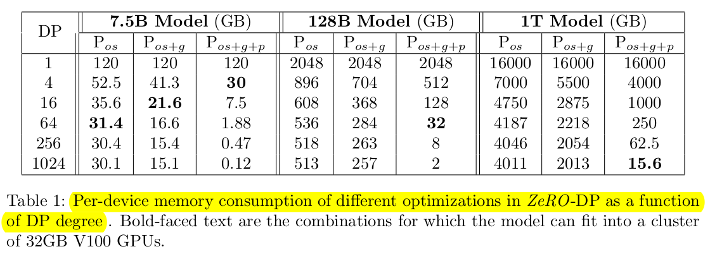
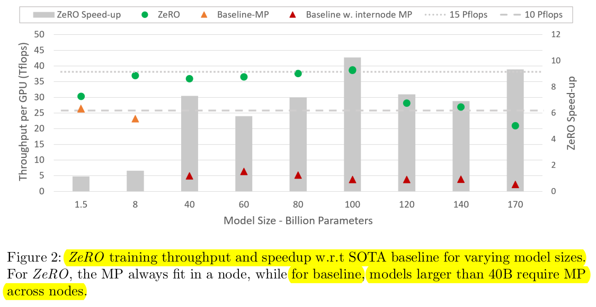
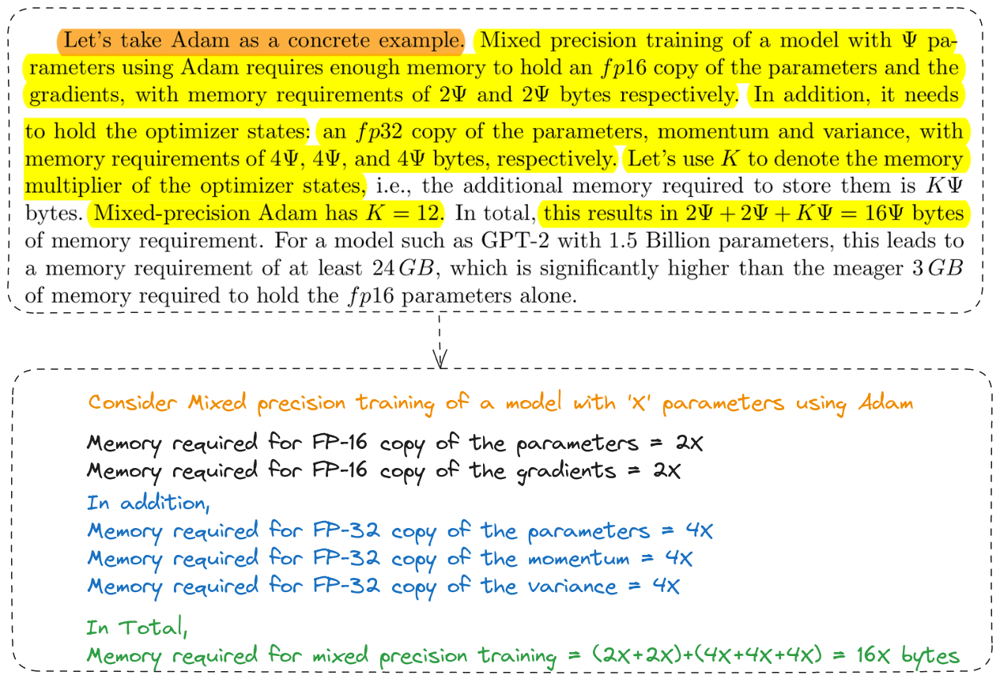

# Research Paper Note
| References | Link |
| ---- | ---- |
| Research Paper | [ZeRO: Memory Optimizations Toward Training Trillion Parameter Models](https://github.com/Rai-Nabin/Daily-Learning/blob/master/DeepSpeed/pdf/ZeRO.pdf) |

# Abstract

- Training very large deep learning models with billions to trillions of parameters is challenging due to memory limitations.
- Zero Redundancy Optimizer (ZeRO) has been developed as a novel solution to optimize memory usage and improve training speed.
- ZeRO eliminates memory redundancies in data- and model-parallel training, enabling efficient scaling of model size based on the number of devices used.
- ZeRO implementation and evaluation: Trained models with over 100 billion parameters on 400 GPUs, achieving super-linear speedup and a throughput of 15 Petaflops.
- ZeRO (Zero Redundancy Optimizer) enables training models with up to 13 billion parameters without requiring model parallelism, improving speed and efficiency.
- ZeRO innovations enabled creation of world's largest language model with 17B parameters and record-breaking accuracy.
# Introduction
- Data Parallelism (DP)
	- Involves replicating the entire model across all devices, which leads to redundant memory consumption.
- Model Parallelism (MP)
	- Divides the model into layers that are processed by different devices.
- Among different existing solution for training large models, MP is the most promising.
- The limitations of MP become apparent when scaling beyond certain model sizes (11B T5 model, and Megatron-LM 8.3B) due to increased communication requirements between layers.
- The memory consumption during model training can be divided into two main parts:
	1. Majority memory occupied by Model States
		- Include optimizer states (such as momentum and variances in Adam), gradients and parameters.
	2. Remaining memory occupied by Residual States
		- Include activation, temporary buffers, and unusable fragmented memory.
- Optimizing Model State Memory
	- Zero-powered data parallelism (ZeRO-DP)combines communication efficiency of DP with memory efficiency of MP.
	- ZeRO-DP has three main optimization stages:
	
	
- Optimizing Residual State Memory
	- ZeRO-R is developed to optimize residual memory consumed by activation, temporary buffers, and unusable fragmented memory respectively.
		1. Activations (stored from forward pass for backward pass) are optimized through activation partitioning to remove replication in existing MP approaches. Offloading activations to CPU when appropriate also helps in optimizing activation memory.
		2. Temporary buffers have an appropriate size defined by ZeRO-R to balance memory and computation efficiency effectively.
		3. Fragmented memory during training due to varying lifetimes of tensors can lead to allocation failures even with enough free space. ZeRO-R proactively manages this fragmentation issue based on tensor lifetimes.
- ZeRO and MP
	- ZeRO-DP is demonstrated to be equally or more effective than MP in decreasing per-device memory usage, particularly when MP encounters challenges in evenly dividing the model across devices.
	- There are specific scenarios where leveraging Model Parallelism (MP) alongside ZeRO can be advantageous:
		1. When combined with ZeRO-R, Model Parallelism (MP) can help reduce activation memory usage for very large models.
		2. For smaller models where activation memory is not an issue, MP can also have benefits when aggregated batch size using DP alone is too big to have good convergence.
- Implementation and Evaluation
	- Due to limited hardware compute capacity and long training times exceeding a year, the focus shifts to efficiently supporting models with 100 billion parameters (10x more than current state-of-the-art).
	- A subset of ZeRO optimizations called ZeRO-100B is implemented, combining ZeRO-DP and ZeRO-R techniques.
	- This implementation enables handling larger models efficiently within the constraints of current hardware capabilities.
		- Model Size: By utilizing ZeRO-100B optimization techniques along with MP, it becomes feasible to train models efficiently with 170 billion parameters. In contrast, existing systems like Megatron struggle to scale beyond 40 billion parameters effectively. This comparison highlights an over 8x increase in model size achievable through ZeRO-100B compared to the current state-of-the-art capabilities.
		- Speed: Improved memory efficiency powers higher throughput and faster training.
		- Scalability: It shows superlinear speedup between 64 to 400 GPUs, where performance more than doubles with a doubling of GPUs. This increase in performance is attributed to ZeRO-DP reducing memory usage for model states as the degree of data parallelism (DP) increases. By decreasing memory footprint, larger batch sizes per GPU become feasible, resulting in enhanced performance during training. The expectation is that this trend will persist and even improve further as the number of GPUs utilized exceeds 400.
		- Democratization of Large Model Training: Data scientists can experiment freely with large models using ZeRO-100B without worrying about parallelism constraints. Unlike existing systems like PyTorch Distributed Data Parallel that face memory limitations with only 1.4 billion parameter models.
		- New SOTA Model: ZeRO powers the largest language model with 17B parameters and record-breaking accuracy.

         
         
         
# Related Work
- Data, Model and Pipeline Parallelism
	- Data Parallelism (DP)
		- DP is employed when the model can fit within the memory constraints of a single device.
		- Model parameters are replicated on each device participating in training.
		- During training, a mini-batch of data is evenly divided across all data parallel processes or devices.
		- Each process works on its subset of data samples simultaneously.
		- Forward propagation involves passing input through the neural network to generate predictions. This step occurs independently on each device for their respective subsets of data samples.
		- Backward propagation calculates gradients by propagating errors backward through the network, also done independently per process.
		- Averaged gradients from all processes are used to update the model locally after forward and backward passes have been completed.
	- Model parallelism (MP)
		- Involves splitting the model among different processes vertically.
		- Used when a model is too large to fit in the memory of a single device.
	- Pipeline Parallelism (PP)
		- Involves splitting the model among different processes horizontally.
		- Used when a model is too large to fit in the memory of a single device.
		- Uses micro-batching to manage data flow.
		- Implementing tied-weights and batch-normalization can be difficult due to horizontal splitting and micro-batching.
- Non-parallelism based approach to reduce memory
	- Reducing Activation Memory
		- Multiple approaches aim to reduce the memory usage of deep learning training by compressing activations, utilizing activation checkpointing, or employing live analysis techniques. These methods, such as compression, checkpointing, and live analysis, can be used in conjunction with ZeRO, a memory optimization technique. 
		- Specifically, in ZeRO-R, activation memory reduction works alongside activation checkpointing to further enhance memory efficiency during deep learning training.
	- CPU Offload
		- Offloads model states to CPU memory during training.
		- Up to 50% of training time can be spent on GPU-CPU-GPU transfers, highlighting the importance of efficient memory management.
	- Memory Efficient Optimizer
		- Focus on reducing memory consumption of adaptive optimization methods by main-taining coarser-grained statistics of model parameters and gradients, with potential impact on model convergence guarantees.
- Training Optimizers
	- Adaptive optimization methods are essential for achieving state-of-the-art performance and accuracy in training large models. 
	- These methods maintain detailed statistics for each model parameter and gradient, which can require significant memory usage. 
	- ZeRO optimization technique reduces the memory footprint of adaptive optimizers by orders of magnitude. 
	- This reduction enables practical training of large models on devices with limited memory capacity. 
	- With ZeRO, it becomes feasible to explore more complex and memory-intensive optimization strategies that may lead to improved convergence during model training.

# Where Did All the Memory Go?
- A 1.5B parameter GPT-2 model requires 3GB  of memory for its weights (or parameters) in 16-bit precision, yet, it cannot be trained on a single GPU with 32 GB memory using Tensorflow or PyTorch. One may wonder where all the memory goes.
- Model States: Optimizer States, Gradients and Parameters
	- During model training, a significant portion of memory is used by model states (optimizer states, gradients, and parameters).
	- The Adam optimizer is commonly used in model training.
	- Adam requires storing two key optimizer states: the time-averaged momentum and the variance of gradients to calculate updates.
	- Optimizer states typically consume the most memory, especially in scenarios like mixed-precision training.
	- Mixed-Precision Training
		- During mixed-precision training, both the forward and backward propagation are performed using fp16 weights and activations. However, to effectively compute and apply the updates at the end of the backward propagation, the mixed-precision optimizer keeps an fp32 copy of the parameters as well as an fp32 copy of all the other optimizer states.
		
- Residual Memory Consumption
	- Activations
		- Activation can take up a significant amount of memory during training.
		- A GPT-2 model with 1.5 billion parameters, trained with a sequence length of 1K and batch size of 32, may require around 60 GB of memory.
		- Activation checkpointing is a technique used to reduce activation memory consumption by approximately the square root of total activations.
		- This technique introduces about a 33% re-computation overhead.
		- This would reduce the activation memory consumption of this model to about 8 GB.
	- Temporary buffers
		- Temporary buffers are used for storing intermediate results during training of large models.
		- Operations like gradient all-reduce combine gradients into a single buffer to improve processing speed. 
		- The buffer can be larger depending on the operation type, such as fp32 format for certain operations. 
		- In a model with 1.5 billion parameters, a flattened fp32 buffer would require 6 GB of memory.
	- Memory Fragmentation
		- Memory fragmentation can lead to running out of usable memory during training, even when there is sufficient total memory available. 
		- Memory fragmentation occurs when there is not enough contiguous memory to fulfill a memory request, causing out-of-memory issues despite having unused memory. 
		- This issue is particularly significant when training very large models, resulting in operational challenges during the training process.