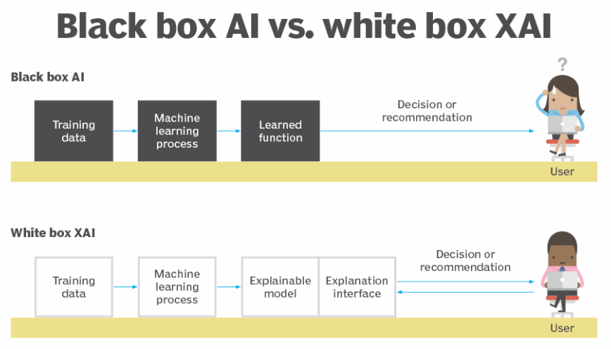
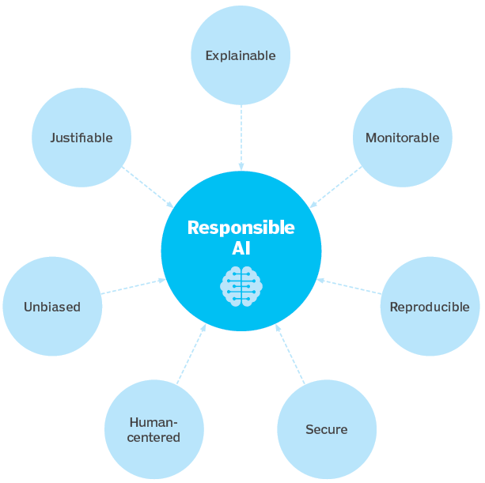

# Explainable AI, or XAI
It's a set of techniques that help people understand how machine learning algorithms make decisions.

**Why is XAI important?**

- **Trust and Confidence:** People are more likely to trust and accept AI decisions if they can understand how they are made.
- **Model Improvement:** XAI helps developers identify and fix errors in AI models.
- **Fairness and Regulation:** XAI can help ensure AI models are fair and unbiased, which may be required by regulations.

**The "Black Box" Problem:**

- Traditional AI models are often like black boxes - their internal workings are mysterious even to their creators.
- XAI aims to open these black boxes and make AI models more transparent.

**Current State of Explainable AI (XAI):**

- **XAI Exists, But It's Evolving:** There are techniques for XAI, but the exact definition and best practices are still being developed.
- **Challenges with Complex Models:** XAI can be harder to implement on intricate AI models with many features or steps.

**History of Explainable AI**

- The need for XAI has been around since the early days of AI (1970s).
- Examples:
    - MYCIN system (1972): Explained medical diagnoses for blood infections.
    - Truth Maintenance Systems (1980s-1990s): Tracked reasoning steps in rule-based AI for explanations.
- **XAI Gains Importance in the 2010s:**
    
    - As AI became more public, concerns about bias emerged.
    - This led to a greater focus on developing methods to detect bias in AI models.

**Explainability vs Interpretability in AI**

**Interpretability:**

- Focuses on understanding the **cause** behind an AI's decision (**why** it made a specific choice).

**Explainability:**

- Goes beyond interpretability by explaining the **process** the AI used to arrive at a decision (the **how**).

**Explainable AI (XAI) vs Responsible AI**

- **Goal:** Both aim for trustworthy AI.
- **Approach:**
    
    - **Explainable AI (XAI):**
        - Focuses on explaining **existing** AI results (after the AI has made a decision).
        - Helps users understand how the AI arrived at its conclusions.
    - **Responsible AI:**
        - Focuses on building ethical and accountable AI from the beginning (during the planning and development stages).
        - Ensures the AI is built with fairness, transparency, and responsible data use in mind.
- **Working Together:**
    
    - XAI and Responsible AI complement each other for better AI.
        - XAI helps identify issues in an existing AI.
        - Responsible AI helps prevent those issues from arising in the first place.

**Limitations of XAI**

- **Oversimplification:** XAI explanations might be too simple, misrepresenting the complex inner workings of the AI. This can lead to debates about creating more interpretable models or ones that better connect causes to effects.
    
- **Reduced Performance:** XAI systems often perform less well compared to complex "black box" models.
    
- **Training Challenges:** Developing AI with built-in explanation capabilities is inherently more complex than creating black box models.
    
- **Privacy Concerns:** If XAI relies on confidential data, the transparency of the explanations could expose sensitive information.
    
- **Limited Trust Increase:** Even with explanations, some users might still struggle to trust the AI's decisions.

**References:**

- [What is explainable AI?](https://www.ibm.com/topics/explainable-ai) 
- [explainable AI](https://www.techtarget.com/whatis/definition/explainable-AI-XAI)
