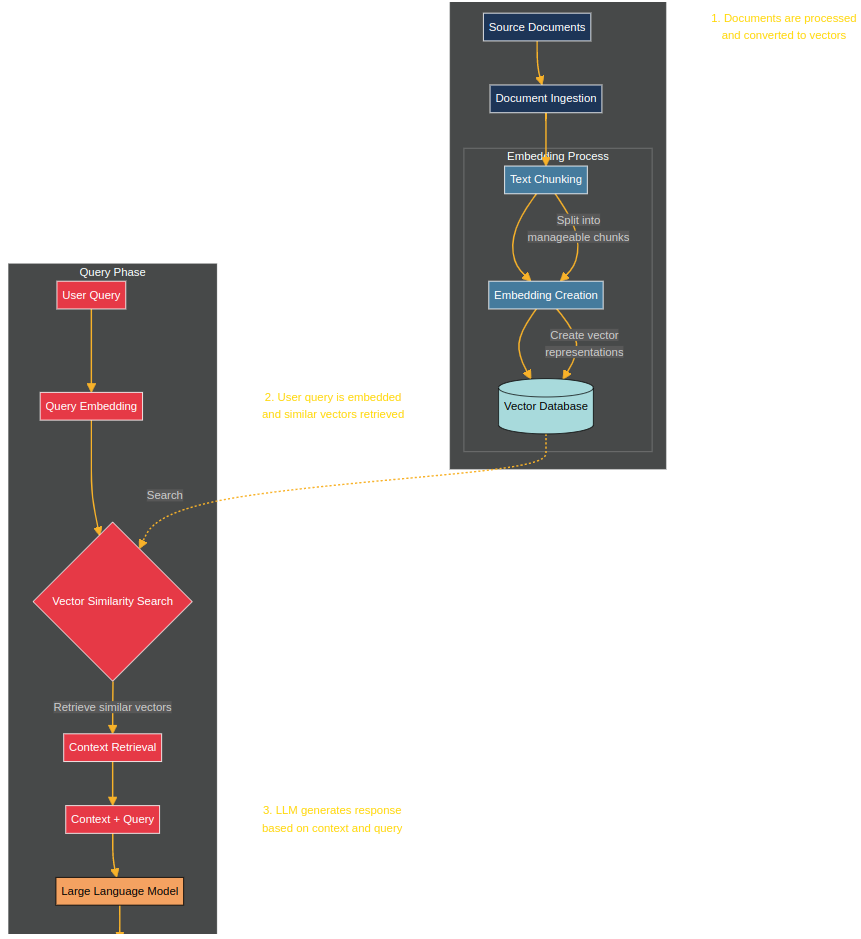
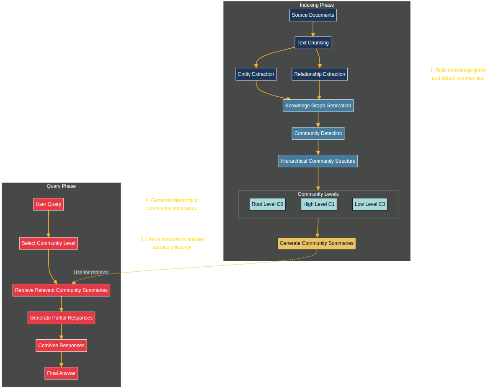

Reference: [link](https://www.youtube.com/watch?v=vX3A96_F3FU)
# Introduction to Graph RAG:
- Microsoft has open-sourced GraphRAG, a system that integrates knowledge graphs with Retrieval Augmented Generation (RAG) to overcome limitations of traditional RAG systems.
- The system can be used with both proprietary models like GPT-4 and local models like Lama 3.
- The video discusses how GraphRAG works, its cost implications, and how to set it up on a local machine.
# Traditional RAG Approach:
- **Steps**:
	1. **Document Processing:** Documents are divided into sub-documents (chunks) using a chunking strategy, embeddings are computed for these chunks, and stored in a vector store as the knowledge base.
	2. **Query Phase:** When a query is made, embeddings for the query are computed, a similarity search is conducted on the vector database, and the most relevant chunks are retrieved.
	3. **Response Generation:** The query and retrieved chunks are combined and input into a language model to generate a response.
- **Limitations**:
	1. **Limited Contextual Understanding:** Traditional RAG may miss nuances and fail to understand the overall document picture.
	2. **Scalability Issues:** As the corpus grows, retrieval efficiency decreases.
	3. **Complexity:** Integrating external knowledge sources can be cumbersome.

# Graph RAG Approach:
- GraphRAG addresses traditional RAG's limitations by incorporating entity and relationship extraction within documents, creating a knowledge graph that captures the relationships between entities across chunks.
- **Phases:**
    1. **Indexing Phase:**
        - **Chunking:** Similar to RAG, documents are chunked.
        - **Entity & Relationship Extraction:** Entities (e.g., people, places) and their relationships are identified and used to build a knowledge graph, forming communities of closely related entities.
        - **Summarization:** Summaries are created for these communities at different levels (local to global).
    2. **Query Phase:**
        - **Community Selection:** The query determines the level of detail needed (global or local), and summaries from relevant communities are retrieved.
        - **Response Generation:** Responses are generated from these summaries and combined into a final answer.
- **Advantages:**

	- GraphRAG provides a more holistic overview of documents, improving understanding and summarization compared to traditional RAG.
	- It offers more flexibility in handling complex queries by leveraging the structured knowledge graph.

# Setup
Please follow the video.
# Costs Implications
- Running GraphRAG can be costly due to the extensive use of LLMs for tasks like entity extraction, summarization, and query processing.
- For example, processing a single book with GraphRAG involved over 570 API requests to GPT-4, resulting in a cost of around $7, which could be prohibitively expensive for larger datasets.
- Traditional RAG systems may be more cost-effective for certain use cases, especially where a holistic understanding of the document is less critical.

# Alternative Implementations:

- Other companies like Lama Index and Neo4j have their own implementations of Knowledge Graph RAG systems.

| Links |
| ---- |
| Graph RAG: [https://tinyurl.com/y3f9cbnd](https://www.youtube.com/redirect?event=video_description&redir_token=QUFFLUhqa01YSkFFdWI1SjdfajkyTEItODAtMlF1VHN2QXxBQ3Jtc0trRzUwQWZkMm1JRDdlcWlJNGVCX0lfZjh3emJaaWpuaXRqTFgta0JLTWdKMWN4ZEY3ZkZoeVJoZlNqNFBseUs2eHpCRHkxQVdVbFNxS1M3RmxoLUc3NTJUS3pHZlBvaS0tNUxXQnhvMHRZeTJKUkdfTQ&q=https%3A%2F%2Ftinyurl.com%2Fy3f9cbnd&v=vX3A96_F3FU) |
| Github: [https://github.com/microsoft/graphrag](https://www.youtube.com/redirect?event=video_description&redir_token=QUFFLUhqbnZ4SnE0T0p0Z3R3NURsMVpSZTQ4MlZ6bmhNZ3xBQ3Jtc0tsdkVIUmNsbXhZamxOZGdCSld5dUdobUI3UzdNdDZITjBJSkZHSHFtUWpJNzJKb1Jmc2gyZnhQbTNIREJJWm5LVS1SMUVXbnJKOEZvUDhiTmtVM3pYQjlqTmVZQXlrUXByYUpmNVh6OUQ3cWRaRkxiWQ&q=https%3A%2F%2Fgithub.com%2Fmicrosoft%2Fgraphrag&v=vX3A96_F3FU) |
| GraphRAG flowchart: [https://tinyurl.com/2s4ytcur](https://www.youtube.com/redirect?event=video_description&redir_token=QUFFLUhqbnBXM1RvemFmUmlvX296OThtWFM5VE92WHVXQXxBQ3Jtc0tsYXJsYi03X0Z4M3ZRR29Qekkwck9kMVFRS2JpNGplSUFIS3VOUkJ6UDZmTWN3UHNJc1ZKVlJ4dml2U1ROeFJMeGNqT2lIQW4zZmxSOHB3bTg1ODF0LWpxU2pSaWFvc1hzcTNTNEEtNk9ZUHEteTVVTQ&q=https%3A%2F%2Ftinyurl.com%2F2s4ytcur&v=vX3A96_F3FU) |
| RAG flowchart: [https://tinyurl.com/56mwzkk7](https://www.youtube.com/redirect?event=video_description&redir_token=QUFFLUhqbG9SNFpuZkl1S3ZFS1NoQ3gwaTh0LTNubmJ2UXxBQ3Jtc0tra3paS3UwNllmdzBwRWEzdFFvQVd0anZUV09XMHowSUNMc283RjhuYTdoOFlXc0J0YmFQMlB0YkdCVFltdkpvYUc4UGhtY2ZhUDVoMUhBdThSbFpfb0VEemNOZHdGUFJEWGc1NDY1d0E2UU9vZFIwUQ&q=https%3A%2F%2Ftinyurl.com%2F56mwzkk7&v=vX3A96_F3FU) |
