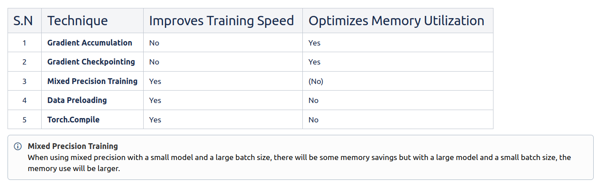
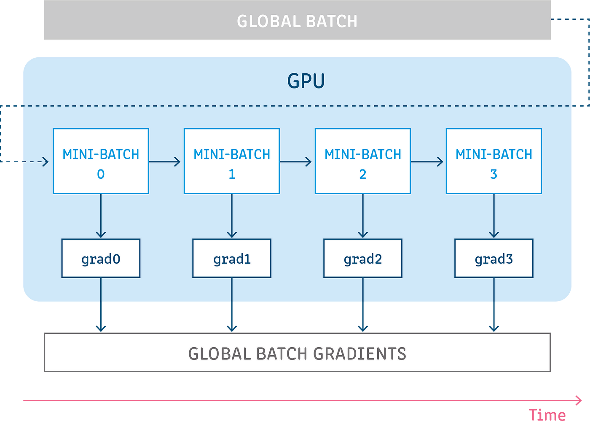
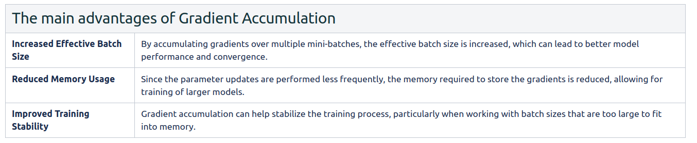
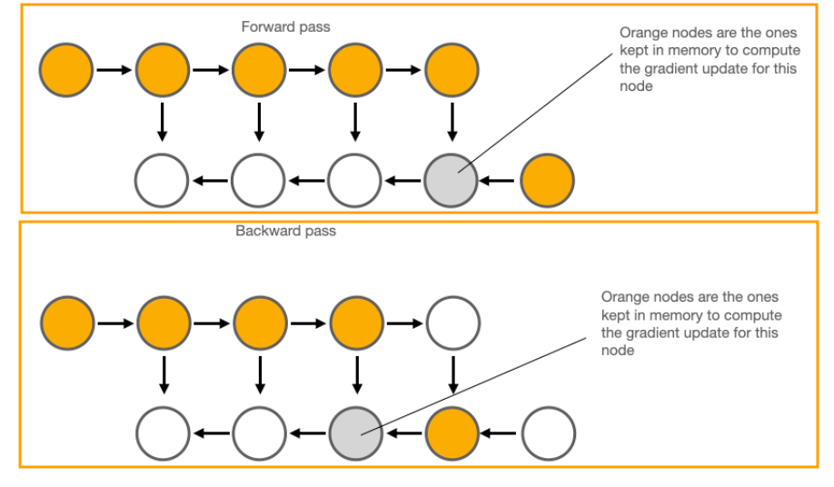
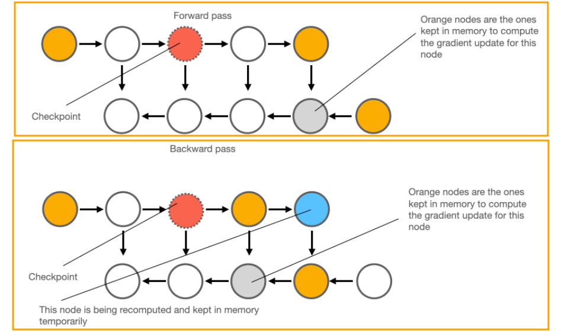
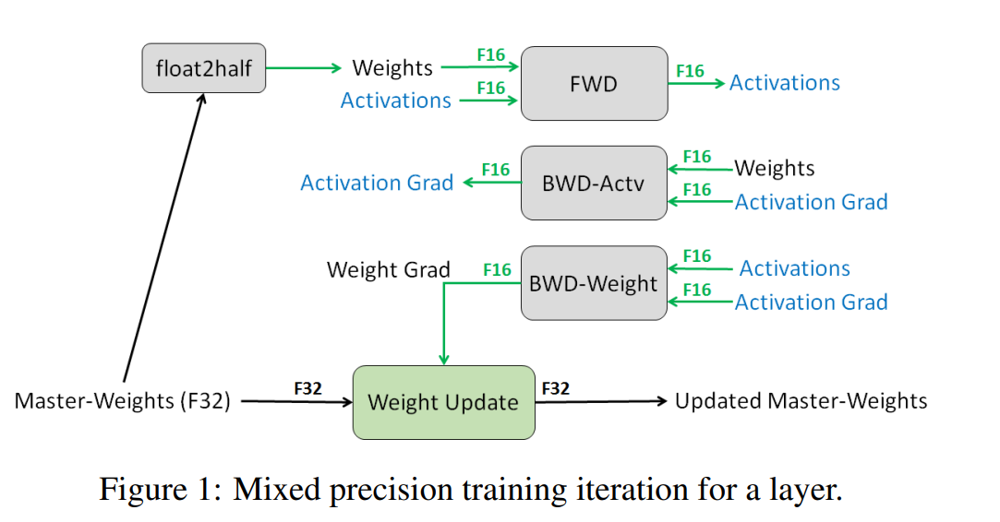
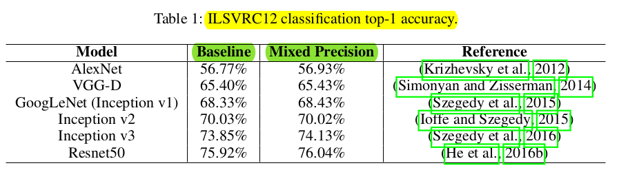
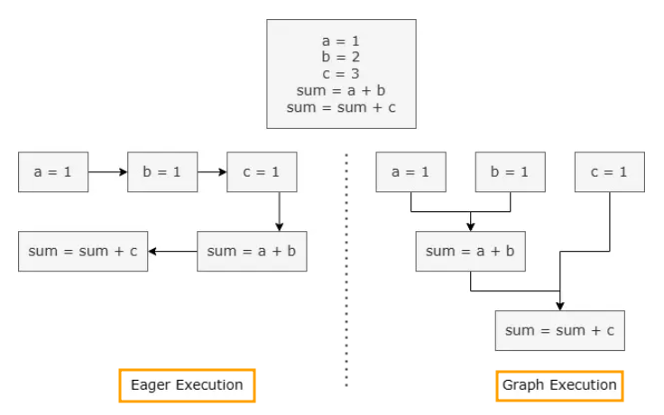
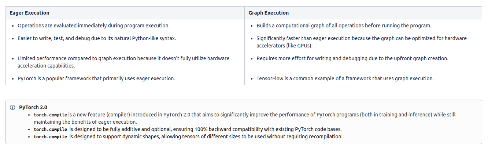
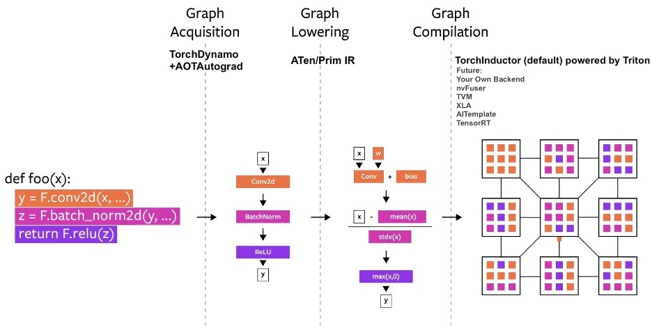

# Methods and Tools for Efficient Training on a Single GPU
*Resources*

| S.N | Topics | Link |
| :--: | ---- | :--: |
| 1 | Methods and Tools for Efficient Training on a Single GPU | [link](https://huggingface.co/docs/transformers/main/en/perf_train_gpu_one#gradient-accumulation) |
| 2 | Performance and Scalability: How to Fit a Bigger Model and Train It Faster | [link](https://huggingface.co/docs/transformers/v4.18.0/en/performance) |

**When training large models, there are two aspects that should be considered at the same time:**
- Data Throughput/Training Time
- Model Performance

**What is Data Throughput?**

Data Throughput means "the speed at which training data is fed into the model during training process". Higher data throughput means that the model can process more training examples in a given amount of time, leading to faster training.

**How to maximize Data Throughput and minimize Training Time?**

- Utilize the GPU as much as possible
- Use techniques like Gradient Accumulation when the desired batch sized exceeds GPU memory limits, but avoid them if the batch size fits comfortably within memory to prevent from slow training time.

# Gradient Accumulation
**What is Gradient Accumulation?**

Gradient accumulation is a technique used in training neural networks to overcome memory limitations and support larger batch sizes.

> **How mini-batch stochastic gradient descent updates model parameters?**
> 
> The model parameters are updated after processing each individual batch of training data.

In Gradient Accumulation, the gradients  are accumulated over multiple batches before updating the model parameters. Specifically, the gradients are computed for each mini-batch, but the parameter updates are only performed after a certain number of mini-batches have been processed (e.g. every 4 batches).

**References:**
- [Gradient Accumulation](https://www.hopsworks.ai/dictionary/gradient-accumulation)
- [What is Gradient Accumulation in Deep Learning?](https://towardsdatascience.com/what-is-gradient-accumulation-in-deep-learning-ec034122cfa)
# Gradient Checkpointing
**How Vanilla Back Propagation Works?**
1. Forward pass to compute and store activations of all layers
2. Backward pass to compute gradients at each layer

In vanilla back propagation, the required memory grows linearly with the number of layers _n_ in the neural network. This is because all nodes from the forward pass are being kept in memory (until all their dependent child nodes are processed).

**How Gradient Checkpointing Works?**

**Forward Pass:**
- Only certain intermediate activations (checkpoints) are stored in memory during the forward pass.
- The selection of these checkpoints can be based on various strategies, such as every 'n' layers or based on specific memory constraints.

**Backward Pass:**
- Some intermediate activations were not stored (due to checkpointing), they need to be recomputed before calculation. This recomputation involves redoing parts of the forward pass from the last checkpoint to the desired layer.
- The gradient is then computed using the recomputed activations.

**Benefits of Gradient Checkpointing:**
- **Reduced Memory Usage**: By recomputing checkpointed activations, gradient checkpointing reduces the memory required to store the gradients, which can be particularly useful when training large models or processing large datasets.
- **Increased Effective Batch Size**: Gradient checkpointing allows for training with larger effective batch sizes, which can improve model performance and convergence.
- **Improved Training Stability**: By reducing the memory footprint, gradient checkpointing can help stabilize the training process, particularly when working with batch sizes that are too large to fit into memory.

**References:**
- [Gradient Checkpointing Demo](https://github.com/rasbt/deeplearning-models/blob/master/pytorch_ipynb/mechanics/gradient-checkpointing-nin.ipynb)
- [Gradient Checkpointing](https://aman.ai/primers/ai/grad-accum-checkpoint/#:~:text=(accumulated_gradients)-,Gradient%20Checkpointing,-Gradient%20checkpointing%20is)
- [Fitting Larger Networks into Memory](https://medium.com/tensorflow/fitting-larger-networks-into-memory-583e3c758ff9)
# Mixed Precision Training
In Mixed Precision Training, weights, activations, and gradients are stored using half-precision (FP16) to save memory and increase training speed compared to standard single-precision (FP32) training. However, to maintain accuracy, an FP32 master copy of the weights is kept and updated  during optimizer step.

**Why is the FP32 Master Copy Needed?**

- **Small Gradient Values**: FP16 has a limited range for representing numbers. Any value smaller than `2^-24`  becomes zero. In some cases, gradients can be this small, which would lead to updates being lost, thus affecting model accuracy. By maintaining the FP32 master copy, these small values can be retained, ensuring accuracy.
- **High Ratio between Weights and Updates**: FP16 has only 10 bits of mantissa, leading to precision loss when the ratio of weight values to updates is large. If the weight magnitude is at least 2048 times larger than the update, the update can become zero due to right-shifting in the addition process. An FP32 master copy prevents this issue.

**Results:**

- The Baseline (FP32) experiments were conducted on NVIDIA's Maxwell GPU.
- Mixed Precision (FP16) experiments were conducted on Volta V100 GPU.
- In both experiments, identical hyper-parameters were used for ILSVRC classification task.
- In all of these experiments, the top-1 accuracy of mixed precision training were matched to that of baseline.

| **Advantages** |
| :--- |
| **Improved Training Speed**: Lower-precision data types like float16 and bfloat16 can be processed faster by specialized hardware, such as NVIDIA's Tensor Cores. This allows for significantly faster matrix multiplications and convolutions, which are the most computationally intensive operations in neural networks. On modern GPUs like the NVIDIA A100, peak float16 matrix multiplication performance can be up to 16x faster than float32.  **Reduced Memory Usage**: The float16 and bfloat16 data types are half the size of float32, effectively doubling the available memory. This allows for training larger models, using larger batch sizes, or processing larger input data. **Preserved Numerical Stability**: While the lower-precision data types are used for most computations, the model parameters and other critical values are still stored and updated in float32 to maintain numerical stability and prevent loss of precision. |
| **Disadvantages** |
| **Reduced Numerical Precision**: Lowering the precision from float32 to float16 or bfloat16 can lead to a loss of numerical precision, which may impact the accuracy of the model, especially in scenarios where high precision is crucial. **Compatibility Limitations**: Not all GPUs support mixed precision training, as it requires specific hardware features like Tensor Cores. Models trained on hardware without adequate support for mixed precision may not benefit from the speed and memory improvements offered by this technique. |

**References:**
- [Mixed Precision Training](https://arxiv.org/pdf/1710.03740)
- [Train with Mixed Precision Training](https://docs.nvidia.com/deeplearning/performance/mixed-precision-training/index.html)
# Data Preloading
**Training large models often requires optimizing data loading to keep the GPU fully utilized**.

**Here, is how two key arguments in `DataLoader`  can help**:

1. `pin_memory=True` : This preloads the data into a special CPU memory region (pinned memory) that allows faster transfer to the GPU memory.  This bypasses the slower process of copying data from regular CPU memory each time.
2. `num_workers=N` : This spawns `N`  worker processes that work in parallel to preload data from disk. This can significantly increase data loading speed, especially when dealing with large datasets.

When using [Trainer](https://huggingface.co/docs/transformers/main/en/main_classes/trainer#transformers.Trainer), the corresponding [TrainingArguments](https://huggingface.co/docs/transformers/main/en/main_classes/trainer#transformers.TrainingArguments) are: `dataloader_pin_memory` (`True` by default), and `dataloader_num_workers` (defaults to `0`).

| **Advantages** |
| :--- |
| **Faster Training Speeds:** By preloading data into memory (or cache) before it's needed for training, you eliminate the bottleneck of constantly reading data from disk during each training iteration. This can lead to substantial reductions in training time, especially when dealing with large datasets. **Reduced GPU Underutilization:** Data loading from disk can be a slow process compared to GPU computations. Preloading ensures a constant stream of data ready for the GPU, maximizing its utilization and accelerating the overall training process. **Reduced Training Variability:** When data is read from disk during training, there can be variations in access times depending on factors like disk speed. Preloading removes this variability, leading to more consistent training times across runs. |
| **Disadvantages** |
| **Increased Memory Usage:** Preloading data requires storing it in memory before being used. This can significantly increase memory consumption, especially for large datasets. On systems with limited memory, this might not be feasible. **Limited Portability:** Preloaded data might be specific to the system it was created on. If you intend to transfer your training pipeline to a different system with a different architecture, the preloaded data might not be usable. |

**References:**

- [Data Preloading](https://huggingface.co/docs/transformers/main/en/perf_train_gpu_one#mixed-precision-training:~:text=GitHub%20issue.-,Data%20preloading,-One%20of%20the)
# Torch.Compile
**Lets first understand the fundamental difference between "Eager" and "Graph" executions in Deep Learning Frameworks.**

**Whenever you wrap your model under torch.compile, the model goes through the following steps before execution:**

1. **Graph Acquisition:** The model is broken down and re-written into subgraphs. Subgraphs that can be compiled/optimized are flattened, whereas other subgraphs which can’t be compiled fall back to the eager model.
2. **Graph Lowering:** All PyTorch operations are decomposed into their chosen backend-specific kernels.
3. **Graph Compilation:** All the backend kernels call their corresponding low-level device operations.

### Advantages
- **Performance Boost:** The primary advantage is significant performance gains for training and inference. `torch.compile` optimizes PyTorch code, leading to faster execution times for deep learning models. This is especially beneficial for complex models or large datasets.
- **Preserves Eager Execution:** Unlike TensorFlow's graph execution, PyTorch traditionally relies on eager execution, allowing for easier coding and debugging. `torch.compile` achieves performance improvements while staying within eager execution, making code easier to maintain and understand.
- **Dynamic Shape Support:** PyTorch 2.0 with `torch.compile` allows models to handle tensors with varying sizes during training or inference. This eliminates the need for pre-defined static shapes, making models more adaptable to diverse datasets.
### Disadvantages
- **Limited Performance Gains in Certain Scenarios:** Performance improvements can vary depending on factors like:

	- **Model architecture:** Simpler models might not benefit as much.
	
	- **Hardware:** Gains might be less significant on CPUs or non-compatible GPUs.
	
	- **Dataset size:** Smaller datasets might not see substantial speedups.

**References:**

- [PyTorch 2.0 Overview](https://pytorch.org/get-started/pytorch-2.0/)
- [What's New in PyTorch 2.0? torch.compile](https://pyimagesearch.com/2023/03/27/whats-new-in-pytorch-2-0-torch-compile/)
- [Using torch.compile](https://huggingface.co/docs/transformers/main/en/perf_train_gpu_one#data-preloading:~:text=DeepSpeed%20guide.-,Using%20torch.compile,-PyTorch%202.0%20introduced)

