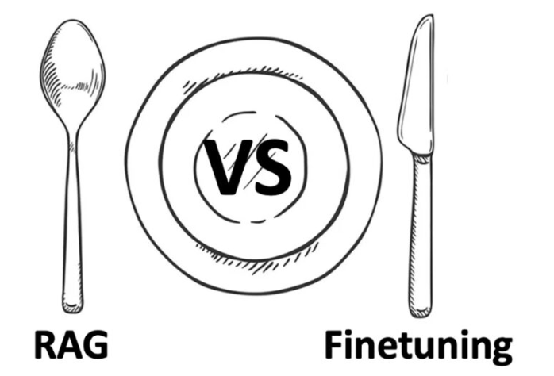
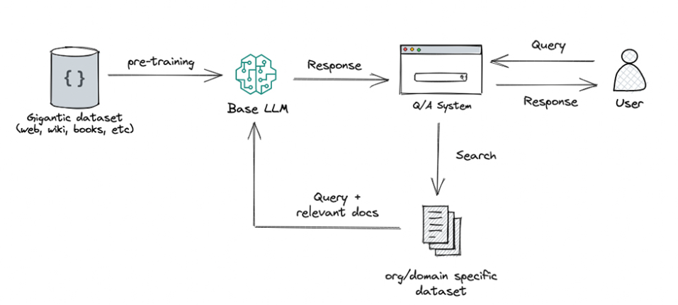
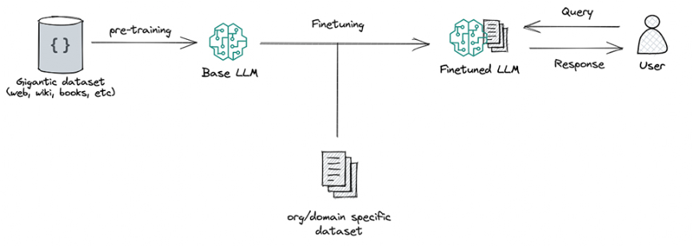

# RAG vs Finetuning
As interest in Large Language Models (LLMs) grows, developers are faced with the challenge of improving their performance in applications. This leads to the consideration of whether to use Retrieval-Augmented Generation (RAG) or model finetuning for better results.

## RAG 
This method combines two powerful techniques: retrieval, which is like searching for relevant information, and text generation using Large Language Models (LLMs). It works by first finding relevant pieces of information from a large corpus of documents, then using that information to help the LLM generate better answers. So, instead of relying solely on what it already knows, the model can "look up" additional information to improve its responses.

## Finetuning
This is the process of taking a pre-trained LLM and further training it on a smaller, specific dataset to adapt it for a particular task or to improve its performance. By finetuning, we are adjusting the model’s weights based on our data, making it more tailored to our application’s unique needs.

