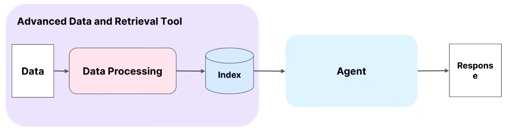

# The Future of Knowledge Assistants
- Video Link: [link](https://www.youtube.com/watch?v=zeAyuLc_f3Q)
- GitHub: [link](https://github.com/run-llama/llama-agents)
- Llama Cloud: [link](https://docs.llamaindex.ai/en/stable/module_guides/indexing/llama_cloud_index/)
### Introduction

- **Presenter**: Jerry, co-founder, and CEO of Llama Index.
- **Topic**: Future of knowledge assistants.
- **Focus**: Advancements and challenges in utilizing LLMs for enterprise applications.

### Current Use Cases of LLMs

- **Document Processing**: Tagging and extraction.
- **Knowledge Search and Question Answering (QA)**: Using RAG (Retrieval-Augmented Generation) techniques.
- **Conversational Agents**: Storing conversation history and generalizing QA interfaces into overall conversational agents.
- **Agentic Workflows**: Synthesizing information and performing actions across various services.

- **Goal**: To build an interface that handles various tasks, from simple questions to complex research tasks, providing outputs ranging from short answers to structured reports.
### Challenges with Basic RAG Pipelines

- **Naive Data Processing**: Simple parsing and chunking are insufficient for production-grade applications.
- **Query Understanding**: Basic RAG struggles with complex, broad queries.
- **Service Interaction**: Lack of sophisticated interaction with other services.
- **Stateless Nature**: No memory of previous interactions.

### Advancing beyond basic RAG
- Moving from simple search to building a general context-augmented research assistant.
- Three Key Steps:
	1.**Advanced Data and Retrieval Modules**:
    - Emphasized the importance of high-quality data in LLM applications.
    - Components of data processing include parsing, chunking, and indexing.
    - The significance of good parsing to reduce hallucinations in LLM outputs (e.g., comparing Llama Parse with Pi PDF).
    - Llama Parse has gained popularity with tens of thousands of users and millions of pages processed.
	
    
    2.**Advanced Single-Agent Query Flows**:
    - Moving beyond single LLM prompt calls by layering different components (e.g., agents) to enhance query understanding, planning, and tool use.
    - Introduction of "Agentic RAG," where LLMs interact with data services as tools.
    - Core components include function calling, query planning, and maintaining conversation memory for stateful services.
	
	3.**General Multi-Agent Task Solver**:
    - The limitations of single agents in handling an infinite set of tasks.
    - Benefits of multi-agent systems:
        - Specialization and focus on specific tasks.
        - Parallelization of tasks for faster processing.
        - Potential cost and latency savings by using weaker and faster models.
    - Challenges in building reliable multi-agent systems, including agent interaction, service architecture, and the transition from Jupyter notebooks to production environments.
	

### Launch of Llama Agents:
- Introduction of Llama Agents as microservices, where each agent operates as a separate service.
- Agents communicate through a central API and work together to solve tasks.
- Emphasis on scalability, multiple request handling, and easy deployment.
- The architecture draws inspiration from resource allocators like Kubernetes.
- Demo of a basic RAG pipeline using Llama Agents to showcase the transition from trivial logic to microservices.

### Llama Cloud:
- Llama Index is opening a waitlist for Llama Cloud, focusing on data quality components such as parsing, chunking, and indexing.
- Targeted at enterprise developers dealing with complex documents.