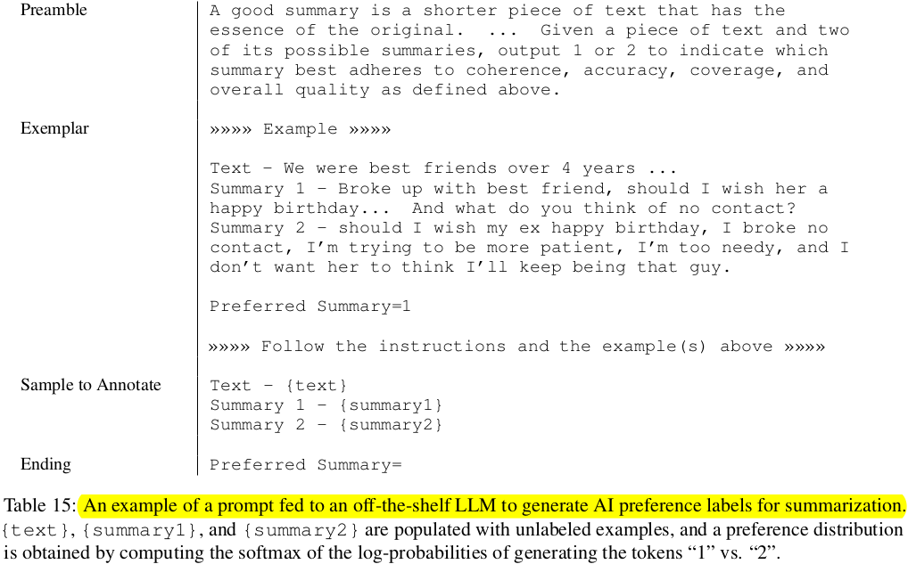
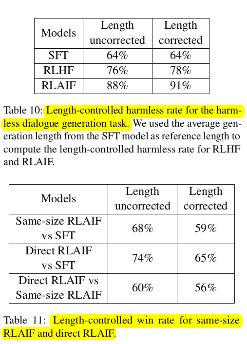

# RLAIF: Scaling Reinforcement Learning from Human Feedback with AI Feedback
- Research Paper Link: https://arxiv.org/pdf/2309.00267.pdf
- Video Tutorial: https://www.youtube.com/watch?v=frHXgb_0o3k&ab_channel=AIMakerspace
- Year of Release: 2023
- Published By: Google Research
## Abstract
**Reinforcement Learning from Human Feedback (RLHF):**

- This is a technique used to train large language models (LLMs). LLMs are AI systems that can generate human-like text based on the input they receive.
- RLHF involves using feedback from humans to guide the learning process of these models so that their outputs align with human preferences.

**Challenges with RLHF:**

- The main challenge here is gathering high-quality feedback from humans which can be time-consuming and expensive because it requires active participation and expertise.

**Reinforcement Learning from AI Feedback (RLAIF):**

- RLAIF is an alternative approach where instead of relying on humans for preference labels, an existing LLM generates them itself by predicting what kind of responses would be preferred in different situations.

**Performance comparison between RLAIF and RLHF:**

- In tasks such as summarization or dialogue generation, RLAIF has shown comparable or even superior performance compared to traditional methods like RLHF according to evaluations done by human raters.

**Outperforming supervised fine-tuned baseline:**

- A "supervised fine-tuned baseline" refers to a model trained under supervision i.e., provided with correct answers during training phase then finely adjusted ("fine-tuned") for specific tasks later on.
- Even when the size of the model generating preference labels was equal led out against policy size in terms of parameters - meaning no extra computational advantage was given - RLAIF still managed better results than this standard setup indicating its efficiency.

**Direct prompting vs distillation into reward model:**

- Directly asking ('prompting') LLMs about reward scores achieved better results than first converting ('distilling') those same predictions into a separate 'reward' system within canonical/traditional setups for applying reinforcement learning via AI feedback.

**Potential of RLAIF:**

- The results suggest that RLAIF has the potential to achieve performance at par with humans while also addressing scalability issues associated with RLHF.
# Introduction
**Reinforcement Learning from  Human Feedback (RLHF):**

- RLHF is a technique used to train language models like ChatGPT and Bard.
- The goal of RLHF is to align these language models with human preferences, meaning it aims for the model's output or behavior to match what a human would find useful or desirable.

**Role of Reinforcement Learning:**

- Reinforcement Learning (RL) is a type of machine learning where an agent learns how to behave in an environment by performing actions and receiving rewards or penalties in return.
- In this context, the 'agent' could be considered as our language model which needs training. The 'environment' can be thought as all possible inputs and outputs for our model.

**Optimization on Complex Objectives:**

- Traditional supervised fine-tuning methods require clearly  defined labels for every instance in their training dataset; however, many real-world problems don't have such neat solutions available upfront. 
- This makes reinforcement learning particularly suitable when dealing with complex sequence-level objectives like those found when training large-scale conversational agents.

**Challenge in scaling RLHF:**

- The main challenge of scaling RLHF is its reliance on high-quality human preference labels.
- This dependence can make RLHF time-consuming and expensive to implement at a large scale.

**Artificially Generated Labels:**

- The potential of using labels generated by AI, specifically large language models (LLMs), as a substitute for human-generated labels in reinforcement learning.
- Large Language Models (LLMs) show high alignment with human judgment, making them suitable for generating these artificial labels.

**Reinforcement Learning from AI Feedback (RLAIF):**

- It involves using feedback from an AI, such as an LLM, instead of human feedback to guide the learning process of another AI system.

**Study Overview:**

- The research investigates the impact of two reinforcement learning methods, RLAIF and RLHF, on three text generation tasks:
    - Summarization
    - Helpful dialogue generation
    - Harmless dialogue generation
- Both RLAIF and RLHF are preferred by humans over the Supervised Fine-Tuning (SFT) baseline.
- There is no significant difference between the preference for these two methods.
- For harmless dialogue generation task, RLAIF scored higher than RLHF.
- These results suggest that AI-generated feedback (RLAIF) could be a viable alternative to human feedback (RLHF), as it doesn't rely on human annotation while offering scalability.

**The main contributions of this research:**

1. Performance Comparison: 
    - RLAIF performs comparably or better than RLHF in tasks such as summarization, and generating helpful and harmless dialogues.
2. Improvement over SFT Policy:  
    - RLAIF can improve upon a Supervised Fine-Tuning (SFT) policy even when the Language Model (LLM) labeler is of equal size to the policy.
3. Direct Prompting Advantage:
    - Directly prompting LLM for reward scores during Reinforcement Learning can outperform traditional setup where a reward model is trained on LLM preferences.
4. Techniques for AI Labels Generation:
    - The study compares different techniques for generating AI labels and identifies optimal settings for practitioners using RLAIF.

# Methodology
**Preferences Labeling with LLMs**

- "Off-the-shelf" LLMs are used to annotate preferences between pairs of candidate responses. These LLMs are pre-trained or instruction-tuned on a large dataset for general language understanding but not fine-tuned for a specific down-stream task.
- Given a piece of text and two potential responses, the LLM determines which response is more preferable.
- The prompt is structured as follows:

**Note:** 

1. Premeable: This is an introduction and instructions describing the task at hand.
2. Few-shot exemplars (optional): These are example input contexts, pairs of responses, optional chain-of-thought rationale, and a preference label.
3. Sample to annotate: This includes an input context and a pair of responses that need to be labeled by the LLM.
4. Ending: Ending text to prompt the LLM (e.g. "Preference Response=")

- Preference Labels Method:
    - An LLM is given a prompt to generate responses based on the provided prompt.
    - Log-probabilities of generating tokens "1" and "2" are extracted from these generated responses.
    - These log-probabilities are converted into a probability distribution using the softmax function.
    - The resulting probability distribution, known as a preference distribution, represents how much preference an LLM has for one response over another.
- Types of Prompts Experimented:
    - Base Prompt - Simply asks which response is better.
    - Detailed Prompt - Provides more specific rating instructions, similar to what human annotators would receive.
- Use of In-context Learning:
    - High-quality examples are chosen across various topics.

**Addressing Position Bias**

- This is a phenomenon in machine learning where the order of presenting options or candidates to an LLM  can influence its preference.
- The paper suggests that position bias becomes more pronounced with smaller sizes of LLM labelers. That means smaller models are more likely to be influenced by the order in which they receive information.
- To counteract this bias, each pair of candidates is evaluated twice - once in original order and once with reversed order.
- After both evaluations (original and reversed), results from both instances are averaged out for final preference distribution.

**Chain-of-thought Reasoning**

- The researchers are experimenting with a method called "chain-of-thought" (CoT) reasoning to improve the inference process of AI models.
- This involves a two-step procedure:
    1. The standard prompt is replaced with a sentence asking for a detailed explanation.
    2. The LLM response is decoded and combined with the original prompt to obtain a preference distribution.

- In zero-shot prompts, the LLM isn't given any examples of what reasoning should look like.

- In few-shot prompts, examples of CoT reasoning are provided for the model to follow.

**Distilled RLAIF**

- Preference labels are obtained from an LLM.
- A Reward Model (RM) is trained using these preference labels.
- Apply a cross-entropy loss to the softmax of the reward scores generated by the Reward Model (RM).
- Training RM on AI-generated labels is similar to model distillation. This technique involves training a simpler model to mimic the behavior of a larger, more complex one.
- The RLAIF policy model learns over time through a process of trial and error, aiming to generate better responses that will receive higher rewards from the RM.

**Direct RLAIF**

- Directly uses feedback from a Large Language Model (LLM) as the reward signal in Reinforcement Learning (RL).
- Bypasses the need for an intermediate Reward Model (RM) that approximates LLM's preferences.
- The LLM rates the quality of generated output on a scale of 1 to 10 based on criteria like factuality and coherence.
- It calculates the likelihood of each score from 1 to 10. These likelihoods are normalized into a probability distribution.
- A weighted score, s(x|c), is computed using these probabilities with a given formula.
- This weighted score is then normalized again, this time ranging between -1 and 1 for final evaluation.
- The computational demand increases when size of AI labeler exceeds that of RM.

**Evaluation**

Results are evaluated with three metrics:

1. AI Labeler Alignment
    - This is a metric used to evaluate the accuracy of AI-labeled preferences in comparison with human preferences.
    - Step 1: The AI's soft-labeled preference (e.g., [0.6, 0.4]) is converted into a binary representation (e.g., [1, 0]).
    - Step 2: A score of '1' is assigned if the AI's label matches the human preference and '0' if it does not.
2. Win Rate
    - "Win Rate" is a metric used to evaluate the effectiveness of two different AI policies.
    - Given an input and two generated outputs (from policy A and B), human evaluators choose which output they prefer.
    - The "win rate" is calculated as the percentage of times policy A's output is preferred over policy B's.
3. Harmless Rate
    - "Harmless Rate" measures the percentage of responses that human evaluators consider harmless.
    - This metric is preferred over the "Win Rate" for evaluating harmless dialogue generation tasks, as many responses can be equally safe, making it challenging to assign relative rankings based on safety.

# Experimental Details
**Datasets**

The following datasets are used for experiments:

- Reddit - It includes Reddit posts and their summaries.
- OpenAI's Human Preferences - Created from a subset of Reddit. It contains a post, two candidate summaries, and a human rating indicating which summary is preferred.
- Anthropic Helpful and Harmless Human Preferences - It comprises conversations between a human and an AI assistant, with each conversation having two possible AI responses - one preferred and the other non-preferred, as determined by a human annotator based on informativeness, honesty, and safety.
- The authors experimented with the Stanford Human Preferences dataset, but found that neither RLHF and RLAIF policies showed significant improvements over the SFT baseline.

**LLM Labeling**

- The researchers randomly reduced the size of each preference dataset training split. This process is known as downsampling and it was done to speed up the evaluation of AI labeling techniques.
- An additional filter was applied specifically for the summarization task. This filter include only those  examples where human evaluators strongly preferred one summary over another.
- After downsampling and filtering, there were roughly 3-4k examples for each task.
- PaLM 2 (L) is used as LLM for labeling preferences.
- The versions used are instruction-tuned but not previously trained with RL.

**Model Training**

- All SFT models starts from a base model called PaLM 2 (XS).
- For the task of summarizing, the SFT model is specifically fine-tuned using the Reddit dataset.
- For tasks other than summarization, an instruction-tuned variant of PaLM 2 is used.
- Reward Models (RMs) are also derived from PaLM2 (XS).
- RMs are fine-tuned on the entire training split of the corresponding preference dataset, where the label is the AI preference for AI feedback RMs and the original human preference label in the dataset for human feedback RMs.
- In the Reinforcement Learning (RL) Phase, the researchers train their policy model using a modified version of an algorithm called REINFORCE. This is specifically adapted for language modeling tasks.
- The choice to use REINFORCE instead of Proximal Policy Optimization (PPO) was made due to its simplicity and effectiveness.
- While PPO is a more recent method that includes techniques for making training more conservative and stable, such as clipping the objective function, it was deemed unnecessary in this context.
- Both policy and value models are initialized from the Supervised Fine-Tuning (SFT) model.
- For summarization tasks, initial data comes from training splits of Reddit's  dataset - essentially summaries provided by users on various topics.
- After responses are generated by policies trained via reinforcement learning methods during summarization task experiments , simple post-processing steps are applied to refine them further.

**Human Evaluation**

- The evaluators were given an input context and multiple responses generated by different AI policies (RLAIF, RLHF, and SFT).
- They were asked to rank these responses based on quality.
- The contexts used for evaluation came from test splits of datasets that weren't used in training or any other evaluations.
- Rankings provided by evaluators were then used to calculate "win rates" for each policy.
- For harmless dialogue generation task specifically, each evaluator rated every single response as either harmless or harmful.

# Results
**RLAIF vs RLHF**

- For all three tasks (summarization, helpful dialogue generation, harmless dialogue generation), both policies perform similarly well or better than a baseline Supervised Fine-Tuned (SFT) policy.
- RLAIF and RLHF are preferred by human evaluators over the baseline SFT policy 71% and 73% of the time for summarization and 63% and 64% for helpful dialogue generation, respectively.
- The difference in win rates between RLAIF vs SFT and RLHF vs. SFT are not statistically significant.
- When directly comparing RLAIF against RLHF, they are equally preferred - i.e., 50% win rate.
- For harmless dialogue generation, RLAIF achieves a harmless rate of 88%, outperforming both RLHF and SFT.
- The lengthier responses generated by RLAIF and RLHF may contribute to their higher win rates, meaning they are preferred more by human evaluators.
- Post-Hoc analysis conducted after the experiment. In this case, it was used to control for response length when comparing the performance of different policies.
- Even when controlling for response length in a post-hoc analysis, both RLAIF and RLHF still outperform SFT policy. This indicates that their superior performance isn't solely due to producing longer responses.
- The researchers tested the integration of human and artificial intelligence (AI) feedback in training AI models, but did not observe any significant improvements compared to solely using human feedback.
- Despite these results, the authors believe there could be potential benefits if different training setups were used for integrating both forms of feedback.
    - Strategy 1:
        - Start with Reinforcement Learning from AI Feedback (RLAIF) to generate responses and collect human preferences.
        - Use these initial results as a "warm-up" policy for refining the model.
        - Follow up by using Reinforcement Learning from Human Feedback (RLHF) to further refine and improve the model.
    - Strategy 2:
        - Proposes collecting more AI-generated feedback than human-provided ones.
        - This strategy is based on cost-effectiveness and efficiency, as gathering large quantities of AI feedback is less costly and easier compared to obtaining human annotations.
- These results suggest that RLAIF is a viable alternative to RLHF as it does not rely on human annotation.
- Using an LLM for labeling in RLAIF policy is estimated to be over ten times cheaper than using humans for annotations. This makes it more economical especially for large-scale applications.

**Towards Self-Improvement**

- The LLM used to label preferences (PaLM 2 L) is much larger than the policy being trained (PaLM 2 XS).
- To explore if improvements can still be achieved with RLAIF when the AI labeler and policy are of equal size.
- Human evaluators preferred the responses generated by RLAIF over those from SFT 68% of the time when the AI labeler was of equal size to the policy model.
- When a larger AI labeler was used, preference for RLAIF increased to 71%.
- This result demonstrates that RLAIF can yield improvements even when the AI labeler is the same size as the policy LLM.
- The AI labeler and the initial policy are two different models. Both models are based on the PaLM 2 XS architecture.
- The AI labeler is instruction-tuned, meaning it follows specific instructions.
- The initial policy is fine-tuned on Reddit dataset summarization.
- Although both models contribute to the summarization process, they aren't identical.
- This experiment does not strictly represent "self-improvement" because summaries rated by the AI were generated by policies created by original dataset curators, not self-generated.
- Despite these differences between model roles in this study, results show promise for future research in reinforcement learning from artificial intelligence feedback (RLAIF).

**Direct RLAIF**

- The researchers used an off-the-shelf language model (LLM), specifically a smaller, instruction-tuned model called PaLM 2 XS, to provide direct feedback during reinforcement learning (RL).
- This approach is referred to as "direct RLAIF". It bypasses the need for training a reward model (RM), which is typically used to distill AI feedback.
- Using a large AI labeler in RL can be computationally expensive. Therefore, they opted for this method that uses the smaller LLM directly
- Human annotators preferred responses generated by Direct RLAIF 74% of the time over Supervised Fine-Tuning (SFT) responses, and 60% of the time over Same-size RLAIF responses.
- In contrast to direct feedback used in Direct RLAFI, same-sized RLAFI uses a Reward Model (RM) for providing feedback during training.
- The improved performance observed with direct use of LLM's feedback is hypothesized to be due to bypassing distillation into a RM which allows information flow directly from off-the-shelf LLMs to policy.

**Prompting Techniques**

- The researchers experimented with three types of prompting variations to improve AI labeler alignment.
    1. Preamble Specificity: This involves the level of detail in the initial instructions.
    2. Chain-of-Thought Reasoning: This method elicits a step-by-step thought process from the AI.
    3. In-Context Learning: This technique uses prior examples in the prompt.
- Chain-of-thought reasoning generally improved AI alignment, while effects of preamble specificity and in-context learning varied depending on task type.
- Compared to base prompts ("Base 0-shot"), best prompts improved performance by:
    - 1.9% for summarization tasks
    - 1.3% for helpfulness tasks
    - 1.7% for harmlessness tasks
- Detailed preambles consistently improve the performance of AI in summarization tasks. This is likely due to the complexity of these tasks, which benefit from specific instructions.
- The impact of detailed preambles on helpful and harmless dialogue generation is mixed. These tasks are more intuitive, so they may not require as detailed instructions.
- Rating helpfulness and harmlessness are easier to grasp intuitively; therefore, they may benefit less from detailed instructions.

**Size of LLM Labeler**

- As model size decreased from PaLM 2 Large to PaLM 2 Small, alignment decreased by 4%.
- Further decrease in model size to PaLM 2 XS resulted in an additional drop in alignment by11%.
- Smaller models may not perform as well due to being more susceptible to position bias. This refers to sensitivity towards order or position of data.
- Increasing the size of the AI labeler could potentially improve the quality of preference labels.
- These labels guide reinforcement learning algorithms.
- The AI labeler is used only once to generate examples, not during ongoing RL process.
- Therefore, using a larger, more complex AI labeler may not significantly increase cost or computational demands.

# Qualitative Observations
- RLHF sometimes "hallucinates" during text summarization. This means it includes plausible but non-existent information from the original text.
- In Example #1 of Table 23, the RLHF summary states that the author is 20 years old, but this is neither mentioned nor implied by the source text.
- RLAIF sometimes produces less coherent or grammatical summaries than RLHF.
- In Example #1 of Table 24, the RLAIF summary generates run-on sentences.
- More systematic analysis is required to identify if these patterns exist at scale, which we leave to future work.

# Conclusion
**Effectiveness of RLAIf:**

- Reinforcement Learning from AI Feedback (RLAIF) shows comparable improvements to Reinforcement Learning from Human Feedback (RLHF) in text generation tasks.
- RLAIF significantly improves upon a Supervised Fine-Tuning (SFT) baseline

**Comparison between RLAIF and RLHF:**

- The margin of improvement with the use of RLAIF is on par with or greater than that achieved by RLHF.
- In direct comparisons, both methods are preferred at similar rates by human evaluators.

**Performance when LLM labeler equals policy size:**

- Even when the Large Language Model (LLM) providing labels is the same size as the policy, effective results can still be obtained using RLAIF.

**Direct prompting vs distilling preferences into separate RM:**

- Directly prompting an LLM labeler to provide rewards during reinforcement learning can outperform traditional setups where preferences are distilled into a separate reward model.

**Future Research Directions:**

- Investigating whether iterative use of 
RLAIF could lead to additional gains.
- Adapting 
RLAIF for usage in model-based reinforcement learning settings where both human and assistant are modeled by large language models.
- Exploring how AI feedback could be used more specifically for credit assignment tasks.