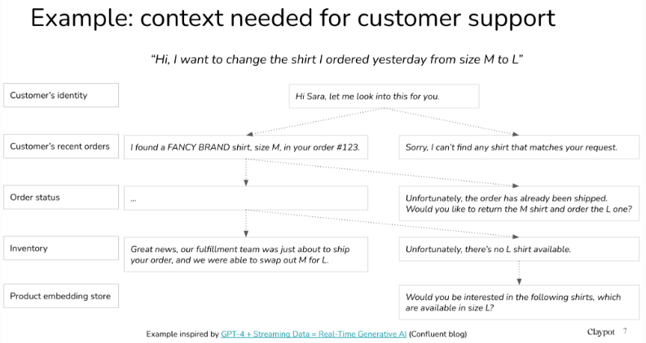

# Recent Research Topics Related To LLM
| S.N | Topics | Descriptions | Reference |
| :--: | ---- | ---- | ---- |
| 1 | **Reduce and Measure Hallucinations** | Hallucination in AI models, particularly LLMs, is a significant barrier to their adoption in production environments. While it can be useful in creative contexts, it is generally seen as a bug that needs mitigation. | [Reduce and measure hallucinations](https://huyenchip.com/2023/08/16/llm-research-open-challenges.html#:~:text=1.-,Reduce%20and%20measure%20hallucinations,-Hallucination%20is%20a) |
| 2 | **Optimize Context Length and Context Construction** | Many questions require specific context to be answered accurately. For instance, asking for the best Vietnamese restaurant needs a location context since the best in Vietnam differs from the best in the US. Research shows that about 16.5% of information-seeking questions are context-dependent, a figure likely higher in enterprise scenarios where customer or product-specific information is essential.  This context learning is crucial for Retrieval Augmented Generation (RAG), a popular method in LLM use cases. RAG operates in two phases:  1. **Chunking (Indexing)**: Documents are divided into chunks, embeddings are created, and stored in a vector database. 2. **Querying**: A user query is converted into an embedding, and the database fetches the most similar chunks.  Longer context can provide more information but isn't always more efficient. Efforts are focused on both increasing context length and improving its efficiency, known as prompt engineering. Recent research indicates that models better understand information at the beginning and end of the context rather than the middle.  | [Optimize context length and context construction](https://huyenchip.com/2023/08/16/llm-research-open-challenges.html#:~:text=NVIDIA%E2%80%99s%20NeMo%2DGuardrails-,2.%20Optimize%20context%20length%20and%20context%20construction,-A%20vast%20majority) |
|  |  |  |  |
|  |  |  |  |
|  |  |  |  |
|  |  |  |  |
